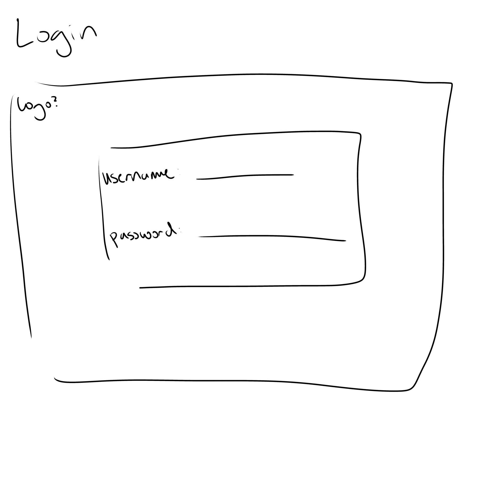
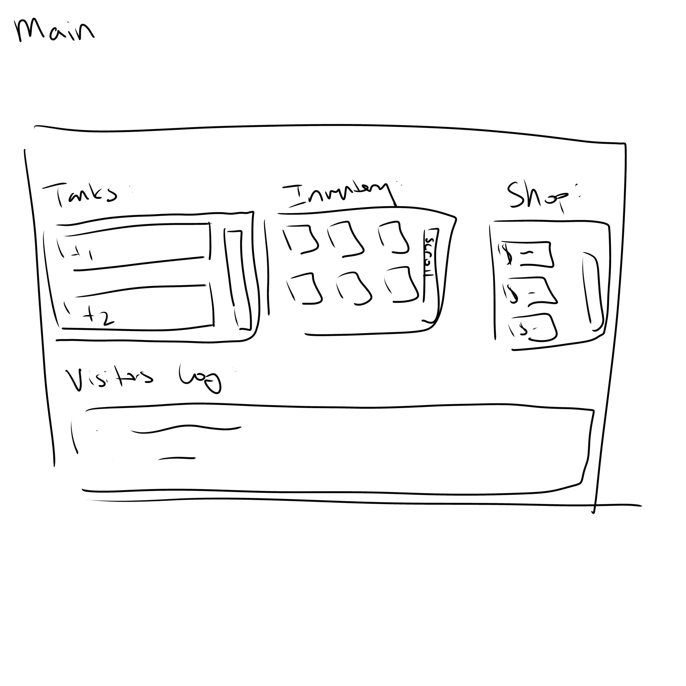
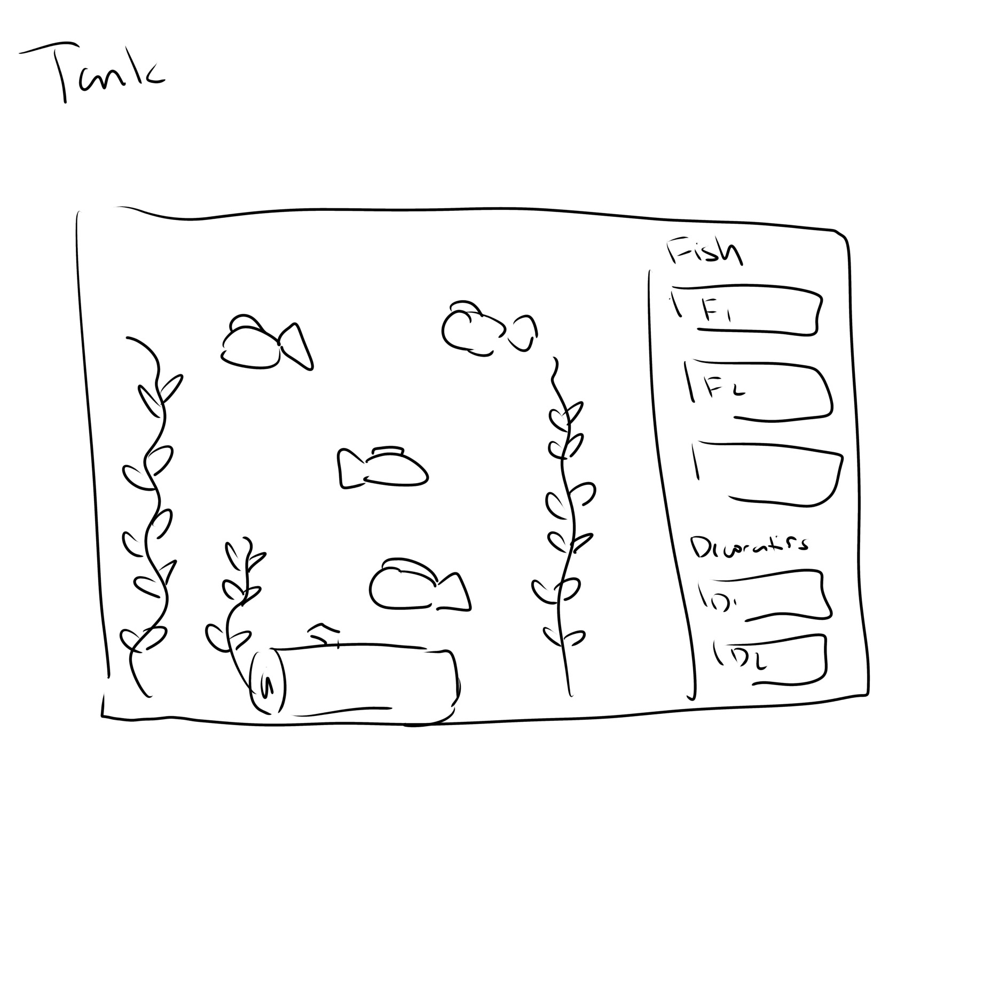

The content below is an example project proposal / requirements document. Replace the text below the lines marked "__TODO__" with details specific to your project. Remove the "TODO" lines.

(___TODO__: your project name_)

# Aquarium Builder

## Overview

(___TODO__: a brief one or two paragraph, high-level description of your project_)

Aquarium Builder a clicker idle game where players earn currency by clicking a button and spend it to buy fish. Each fish added to a tank increases the amount of currency earned per click. Players can also buy decorations and items to boost currency earned and attract special visitors, which will give currency bonuses or special fish species. Player progress will be saved based on username and password. Overall I think the logic is fairly simple but making the page look nice will be harder. Might take out decorations and attracting special visitors if it doesn't seem feasible.


## Data Model

(___TODO__: a description of your application's data and their relationships to each other_) 

The application will store Users, Tanks, Fish, and Items.

Users can own multiple tanks (via references)
Each tank can hold up to 10 fish (via references, enforced in application logic)
Users can hold items in their inventory (via references)
Fish and Items are their own documents to allow for shared species/type definitions

(___TODO__: sample documents_)

An Example User:

```javascript
{
  username: "userA",
  hash: // a password hash,
  currency: //number denoting currency amount owned,
  tanks: // an array of references to Tank documents,
  inventory: // an array of references to Item documents
}
```

An Example List with Embedded Items:

Tank Example:

```javascript
{
  owner: // a reference to a User object,
  name: "Tank A",
  fish: // array of references to Fish documents (max 10),
  decorations: ["castle", "seaweed"]
}
```

Fish Example:

```javascript
{
  species: "Clownfish",
  currencyBonus: 3,
  rarity: "common",
}
```


## [Link to Commented First Draft Schema](db.js) 

(___TODO__: create a first draft of your Schemas in db.js and link to it_)

[User schema](models/User.mjs)
[Fish schema](models/Fish.mjs)
[Tank schema](models/Tank.mjs)
[Item schema](models/Item.mjs)

## Wireframes

(___TODO__: wireframes for all of the pages on your site; they can be as simple as photos of drawings or you can use a tool like Balsamiq, Omnigraffle, etc._)

/login - landing page with login and register links



/main - shows all owned tanks and current currency



/tank/:id - individual tank view with fish, click button, and fish list




## Site map

(___TODO__: draw out a site map that shows how pages are related to each other_)

Here's a [complex example from wikipedia](https://upload.wikimedia.org/wikipedia/commons/2/20/Sitemap_google.jpg), but you can create one without the screenshots, drop shadows, etc. ... just names of pages and where they flow to.

/ (login / register)
├── /register
├── /login
├── /main              ← overview with tanks, inventory, shop
│   └── /tank/:id           ← individual tank

## User Stories or Use Cases

(___TODO__: write out how your application will be used through [user stories](http://en.wikipedia.org/wiki/User_story#Format) and / or [use cases](https://www.mongodb.com/download-center?jmp=docs&_ga=1.47552679.1838903181.1489282706#previous)_)

1. As a non-registered user, I can create an account so that my progress is saved
2. As a user, I can log in to the site so that I can access my tanks and currency
3. As a user, I can click a button to earn currency so that I can buy fish and upgrades
4. As a user, I can view all of my tanks on a dashboard so that I can manage my collection
5. As a user, I can buy fish from the shop so that I increase my currency earned per click
6. As a user, I can buy decorations for my tank so that I can attract special visitors
7. As a user, I can receive special items and rare fish from visitors 

## Research Topics

(___TODO__: the research topics that you're planning on working on along with their point values... and the total points of research topics listed_)

* (3 points) Socket.io for real-time events
    * Socket.io will be used to handle real-time currency updates on click and to trigger live visitor arrival events without requiring a page refresh
* (2 points) Tailwind CSS
    * I will use Tailwind CSS to style the aquarium pages, shop, and collection pages
* (2 points) Authentication / session management
    * I will use a library such as express-session and connect-mongo, or another authentication-related library, so that users can log in and keep separate aquarium data
    * this also helps satisfy privacy/security expectations for user-specific data
* (3 points) 
    * anime.js will be used to animate fish swimming around the tank on the /tank/:id page


10 points total out of 8 required points (___TODO__: addtional points will __not__ count for extra credit_)


## [Link to Initial Main Project File](app.js) 

(___TODO__: create a skeleton Express application with a package.json, app.js, views folder, etc. ... and link to your initial app.js_)

[app.mjs](app.mjs)

## Annotations / References Used

(___TODO__: list any tutorials/references/etc. that you've based your code off of_)

1. based on previous homework asignments
